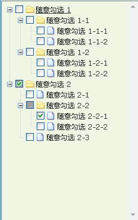

# 说明
## 项目依赖
- jquery库
- jquery.ztree插件
- 选择文件夹接口
```js
<input class="uploadfolder" title="点击选择文件夹" id="h5Input2" multiple="" webkitdirectory="" accept="*/*" type="file" name="html5uploader" style="cursor:pointer;">
```
## 核心点
- 基于jquery.ztree所需要的数据结构，通过递归迭代根据文件目录生成所需的数据结构
- 数据代码结构如下
```js
//数据结构
{ id:1, pId:0, name:"随意勾选 1", open:true},
{ id:11, pId:1, name:"随意勾选 1-1", open:true},
{ id:111, pId:11, name:"随意勾选 1-1-1"},
{ id:112, pId:11, name:"随意勾选 1-1-2"},
{ id:12, pId:1, name:"随意勾选 1-2", open:true},
{ id:121, pId:12, name:"随意勾选 1-2-1"},
{ id:122, pId:12, name:"随意勾选 1-2-2"},
{ id:2, pId:0, name:"随意勾选 2", checked:true, open:true},
{ id:21, pId:2, name:"随意勾选 2-1"},
{ id:22, pId:2, name:"随意勾选 2-2", open:true},
{ id:221, pId:22, name:"随意勾选 2-2-1", checked:true},
{ id:222, pId:22, name:"随意勾选 2-2-2"},
{ id:23, pId:2, name:"随意勾选 2-3"}
```

- 生成的对应的效果图
  + 

- [插件地址] 
  [插件地址]: https://github.com/zTree/zTree_v3

